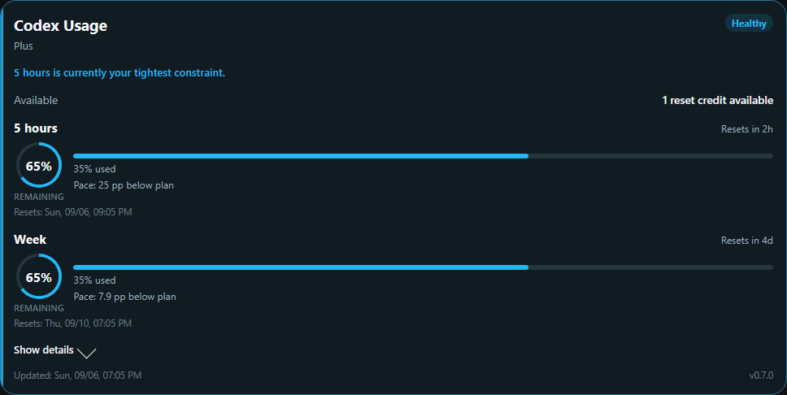
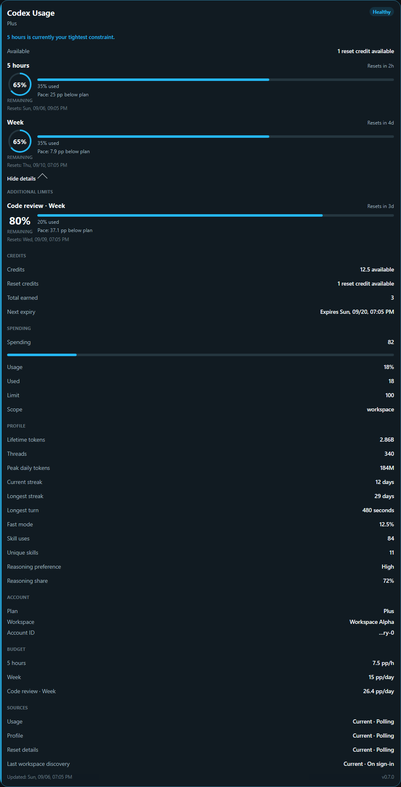

# Codex Usage for Home Assistant


[](https://github.com/hacs/integration)
[](https://github.com/LucaFSmart/codex-usage/actions/workflows/validate.yml)
[](https://github.com/LucaFSmart/codex-usage/releases)
[](LICENSE)

Codex Usage is a read-only Home Assistant integration for Codex allowances included with ChatGPT plans. It monitors reported usage windows, reset times, feature restrictions and optional account data, and includes an English/German dashboard card.

> [!IMPORTANT]
> This independent community project is not affiliated with or supported by OpenAI. It uses authenticated ChatGPT backend endpoints that are not documented as a stable third-party API and may change.



## What it provides

- OpenAI device-code login without passwords, copied cookies or API keys
- Multiple accounts/workspaces with stable Home Assistant entity identities
- Reported five-hour, weekly and additional feature windows without a hard-coded plan matrix
- Consistent unknown, zero, stale, blocked and optional-source behavior
- Saved-reset counts and reconciled expiry details, including banked-reset date changes
- Provider cooldown handling for HTTP 429 and 503, token refresh and reauthentication
- Optional credit, spend, profile and polling-source diagnostics
- Disabled-by-default usage budgets in percentage points per hour
- A configurable bilingual card with standard rows, neutral placeholders and optional source details
- An optional warning Blueprint with persisted hysteresis

The integration never purchases credits, redeems resets, changes limits, sends prompts or selects notification recipients.

## Requirements

- Home Assistant 2026.3.0 or newer
- A ChatGPT account or workspace with Codex access
- Device-code login enabled by the account or workspace administrator
- Outbound HTTPS to `auth.openai.com` and `chatgpt.com`

OpenAI Platform API keys and API billing are a separate product.

## Installation

[](https://my.home-assistant.io/redirect/hacs_repository/?owner=LucaFSmart&repository=codex-usage&category=integration)

Install **Codex Usage** from HACS Integrations, restart Home Assistant, then add it under **Settings → Devices & services** and follow the device-code flow. Add another config entry for another account or workspace.

See [installation and setup](docs/installation.md) for HACS, manual installation, authorization, polling and YAML-managed resources.

## Dashboard card

The integration registers the bundled card automatically for storage-managed dashboards. Select **Codex Usage Card** from the card picker, or add:

```yaml
type: custom:codex-usage-card
```

Standard five-hour and weekly positions stay visible during temporary data loss and show an em dash. Optional sections use Automatic, Always show or Hide; source details are hidden by default. Entity enablement and optional endpoint polling remain separate controls.

```yaml
type: custom:codex-usage-card
account_mode: auto
compact: true
sections:
  limits: { visible: true, values: {} }
  additional_limits: { visible: "auto", values: {} }
  resets: { visible: "auto", values: {} }
  credits: { visible: "auto", values: {} }
  spending: { visible: "auto", values: {} }
  profile: { visible: "auto", values: {} }
  budget: { visible: "auto", values: {} }
  sources: { visible: false, values: {} }
```

Read the [complete card guide](docs/card.md) for account selection, individual values, thresholds, appearance, stale data and budget interpretation.

<details>
<summary>Expanded card</summary>



</details>

## Entities and behavior

Core plan, usage, remaining, reset, pace, available-reset and blocker entities are enabled when their corresponding main windows exist. Credits, spend control, profile aggregates, budgets and source timestamps are disabled by default. Additional feature-window entities are discovered from provider data and retain their identities if the feature later disappears.

Unknown is never converted to zero. A named feature restriction remains visible without making unrelated healthy windows look exhausted. Optional profile/reset errors retain healthy main usage. Budget is a planning rate in percentage points per hour or day, calculated from one successful observation and hidden when stale or invalid.

See the [entity reference](docs/entities.md) for every key, unit, state class, default and absence rule.

## Usage warnings

The optional [warning Blueprint](blueprints/automation/codex_usage/usage_warning.yaml) runs a user-selected action when consumed usage crosses a threshold and uses a dedicated Toggle helper to avoid repeat notifications until usage recovers. It is imported and configured separately. See [warning setup and failure behavior](docs/automations.md).

## Data sources and privacy

The integration reads the authenticated usage source plus optional profile and saved-reset details. Workspace discovery runs during setup and reauthentication. Usage defaults to a five-minute interval; optional sources default to hourly. Provider retry deadlines take priority over configured and manual refreshes.

Tokens are stored in Home Assistant config entries. Card and diagnostic payloads use explicit allowlists and exclude credentials, backend account/user IDs, raw responses and arbitrary error text. See [privacy and data handling](docs/privacy.md) and [security reporting](SECURITY.md).

## Upgrade and support

- [0.7 release notes](docs/release-notes-0.7.md)
- [Upgrading to 0.7](docs/upgrading-to-0.7.md)
- [Troubleshooting](docs/troubleshooting.md)
- [0.7 verification record](docs/verification-0.7.md)
- [Changelog](CHANGELOG.md)

Diagnostics are available from **Settings → Devices & services → Codex Usage** and omit credentials and backend identities. Report defects through the [issue tracker](https://github.com/LucaFSmart/codex-usage/issues).

## Development

```bash
python -m venv .venv
.venv/Scripts/activate
pip install homeassistant==2026.8.3 pytest ruff
ruff format --check .
ruff check .
pytest

cd frontend
npm ci
npm run format:check
npm run lint
npm run typecheck
npm run audit
npm test
npm run test:coverage
npm run check:bundle
npm run test:visual
```

CI repeats the Python runtime suite on the declared minimum Home Assistant version. The built JavaScript is committed under `custom_components/codex_usage/frontend`, so HACS installs integration and card together. See [CONTRIBUTING.md](CONTRIBUTING.md).

MIT License. See [LICENSE](LICENSE) and [ACKNOWLEDGEMENTS.md](ACKNOWLEDGEMENTS.md).
