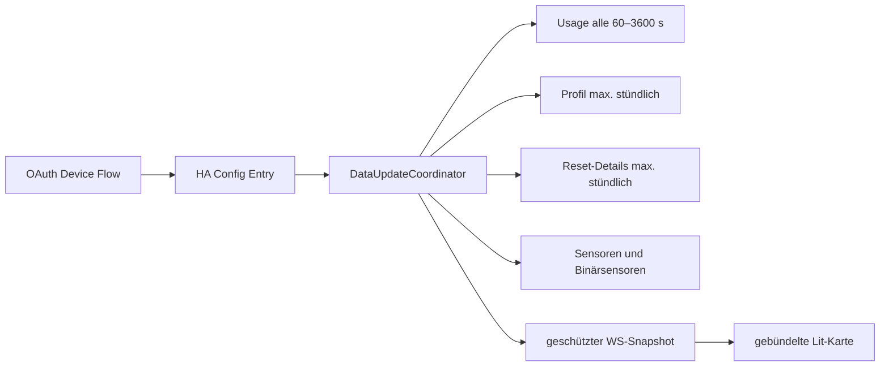

# Codex Usage: vollständiger Integrations-, HACS- und Architekturabgleich

Stand: 4. September 2026. Geprüfter Projektstand und Remote-HEAD: `ba6324715bc7947875aeb0cf670b8dea6abfd520`, Version 0.6.5.

## Entscheidung

Codex Usage besitzt bereits eine gute technische Grundlage. Ein grundlegender Neuaufbau würde mehr Risiko als Nutzen erzeugen. Sinnvoll ist eine **gezielte Modernisierung in drei lieferbaren Paketen**:

1. **Korrektheit und Entity-Semantik (24–38 h):** die drei reproduzierten Datenlücken, Statistikklassen, dynamische Namen und Wiederherstellung dynamischer Entities korrigieren.
2. **Betrieb und Dokumentation (19–32 h):** optionale Abrufe, `Retry-After`, Workspace-Reconfigure, gezielte Repairs sowie eine gegliederte Dokumentation mit echten Screenshots.
3. **Nutzerwert (15–25 h für die empfohlenen Teile):** Warn-Blueprint, Datenfrische-Sensoren und konservatives Restbudget. Account-Vergleich optional zusätzlich 6–10 h.

Mit 25 % Reserve umfasst das empfohlene Programm ohne Account-Vergleich **73–119 Stunden**. Es kann nach jedem Paket beendet werden. Eigene Verlaufsdiagramme, Reset-Kalender und App-Server-Tagesdaten bleiben getrennte Optionen; sie gehören nicht in denselben Umbau.

Die Untersuchung hat keinen Astra-bedingten Pflichtumbau gefunden. Das Produkt bleibt ein lesender Home-Assistant-Monitor für ChatGPT-/Codex-Kontingente, keine Modell-API-Integration.

## Prüfgrundlage und Grenzen

Geprüft wurden alle 74 versionierten Projektdateien, die aktuellen Python-/Frontend-Tests, der erzeugte Kartenbundle, Repository-Metadaten, die öffentlichen CI-Läufe und sechs verbreitete HACS-Repositories. Die Vergleichsprojekte wurden am angegebenen Stand flach ausgecheckt und ihr tatsächlicher Entity-/Dokumentationscode gelesen. Sterne sind nur ein Verbreitungsindikator, kein Qualitätsurteil.

| Projekt                                                                                | Sterne am 04.09.2026 | geprüfter Commit | Relevanter Schwerpunkt                                                           |
| -------------------------------------------------------------------------------------- | -------------------: | ---------------- | -------------------------------------------------------------------------------- |
| [HACS](https://github.com/hacs/integration)                                            |                7.682 | `c462d30`        | Update-Entities, Diagnostik, Repairs, sehr breite Tests                          |
| [Xiaomi Miot Auto](https://github.com/al-one/hass-xiaomi-miot)                         |                6.096 | `5f7ec39`        | dynamische Capability-Entities, konfigurierbare Attribute/Abrufgruppen           |
| [Waste Collection Schedule](https://github.com/mampfes/hacs_waste_collection_schedule) |                2.212 | `1339b9b`        | Calendar statt Datumslisten, optionale Detailattribute, Quellen-Dokumentation    |
| [Dreame Vacuum](https://github.com/Tasshack/dreame-vacuum)                             |                2.165 | `ae8422f`        | `exists_fn`/`available_fn`, Diagnose-Entities, getrennte Events/Aktionen         |
| [PowerCalc](https://github.com/bramstroker/homeassistant-powercalc)                    |                1.578 | `dba7ae4`        | korrekte Device-/State-Classes, fokussierte Attribute, eigene Dokumentationssite |
| [Spook](https://github.com/frenck/spook)                                               |                1.270 | `d4021a7`        | übersetzte Repairs, Diagnose-Entities, ereignisgesteuerte Zustandsprüfung        |

Codex Usage selbst hatte zu diesem Zeitpunkt zwei Sterne, keine offenen GitHub-Issues und 17 Releases. GitHub-Asset-Downloads waren null; HACS-Installationen über automatisch erzeugte Source-Archive werden dadurch nicht belastbar gemessen. Aus diesen Zahlen darf weder geringe noch hohe tatsächliche Nutzung abgeleitet werden.

Lokale Verifikation des unveränderten Anwendungscodes:

- Ruff Format und Ruff Check: bestanden, 21 Python-Dateien.
- pytest: 136 bestanden; fünf Warnungen stammen aus installierten HA-/backoff-Abhängigkeiten.
- Frontend: 112 Vitest-Tests bestanden.
- gemessene Abdeckung der Kernlogik `card-data.ts`, `config.ts`, `status.ts`, `view-model.ts`: 100 % Zeilen, 94,28 % Zweige, 100 % Funktionen.
- 18 Playwright-Prüfungen für Größen, Themes, Zustände und Interaktion: bestanden.
- reproduzierter Bundle-Build: kein inhaltlicher Diff; 79,05 kB, gzip 21,25 kB.
- `npm audit --audit-level=high`: keine bekannte Schwachstelle.
- öffentlicher Validate- und CodeQL-Lauf für exakt `ba63247`: bestanden; der Validate-Workflow enthält HACS, hassfest, HA 2026.8.3, HA 2026.3.0, Linux-Smoke-Test und Frontend-Gates. [Validate-Lauf](https://github.com/LucaFSmart/codex-usage/actions/runs/33619352110).

Kein produktives OpenAI-Konto, keine echten Token und kein Enterprise-Zugang wurden verwendet. Die sechs Fremdrepositories wurden nicht ausgeführt und dienen als Code-/Dokumentationsvergleich. Unterschiedliche Projektgrößen und Anwendungsfälle begrenzen direkte Kennzahlenvergleiche.

## Aktueller Architekturstand



Die Trennung ist grundsätzlich richtig:

- Core-Usage entscheidet über die Verfügbarkeit der Integration.
- Optionale Profil-/Resetfehler lassen die Limits weiterlaufen.
- Parser normalisieren unzuverlässige Antworten in unveränderliche Dataclasses.
- Entities lesen nur Coordinator-Daten und führen kein I/O in Properties aus.
- Ein Service-Device je Nutzer/Workspace hält die Entities zusammen.
- Die Karte bekommt eine eigene, explizit sichere und berechtigungsgeprüfte Darstellung statt Credentials oder Rohantworten.
- Dynamische Zusatzlimits werden capability-basiert statt über eine fest codierte Tarifmatrix erzeugt.

Diese Punkte entsprechen aktuellen HA-Empfehlungen: Properties sollen nur Speicher lesen; Entity Descriptions eignen sich für viele gleichartige Datenpunkte; selten gebrauchte Diagnose-Entities dürfen standardmäßig deaktiviert sein. [HA-Entity-Modell](https://developers.home-assistant.io/docs/core/entity/).

## Vollständiger Befund gegen die aktuelle Integration

### Was beibehalten werden sollte

| Bereich                          | Urteil              | Begründung                                                                                                                          |
| -------------------------------- | ------------------- | ----------------------------------------------------------------------------------------------------------------------------------- |
| Coordinator und optionaler Cache | Stark               | Kern- und Zusatzdaten sind sauber entkoppelt; Fehler eines Profilendpunkts zerstört nicht die Limits                                |
| Parsergrenzen                    | Stark               | Prozent, Dauer, Zeit, Dezimalzahlen und Labels werden defensiv begrenzt; maximal 50 Zusatzlimits verhindert unbeschränktes Wachstum |
| Authentifizierung                | Stark               | Passwort-/Cookie-freier Device Flow, Refresh, einmaliger 401-Retry, HA-Reauth und Workspacebindung                                  |
| Unique IDs                       | Überwiegend stark   | vorhandene IDs und Recorder-Historie werden bewusst erhalten; Nutzername ist nicht Bestandteil der Identität                        |
| Entity-Aufteilung                | Stark               | unabhängige, automatisierbare Werte sind eigene Entities; optionale Details sind deaktiviert                                        |
| Attribute                        | Stark zurückhaltend | aktuell keine eigenen `extra_state_attributes`; verhindert Recorder-Aufblähung und Datenduplikate                                   |
| Diagnostik/Datenschutz           | Stark               | Allowlist statt nachträglicher Redaction; keine Tokens, Account-/User-IDs, E-Mail oder Rohantworten                                 |
| Kartenberechtigung               | Konservativ stark   | eingeschränkte Nutzer erhalten einen Account nur mit Leserecht auf alle zugehörigen Entities                                        |
| Frontend                         | Stark               | Runtime-Parser, visueller Editor, DE/EN, Accessibility-Grundlagen, Themes, Responsive- und Bundle-Tests                             |
| Release-Hygiene                  | Stark               | genaue Action-SHAs, minimale Workflowrechte, Dependabot, CodeQL, Changelog, Min-/Current-HA-Gates                                   |

### Priorität 1: Korrektheit

1. **Reset-Anzahl ist nicht einheitlich.** Usage und stündliche Detaildaten können unterschiedliche Werte liefern; Karte und Sensor wählen heute unterschiedliche Quellen. `parse_reset_credits({})` wandelt eine fehlende Zahl zudem in `0` um. Zentral normalisieren, aktuelle Usage-Anzahl einschließlich des gültigen Werts `0` bevorzugen und Unbekannt erhalten.
2. **Fensterlose Zusatzsperren gehen in der Karte und Diagnostik verloren.** `binary_sensor.limit_reached` erkennt sie, `_limits` und `_safe_data` iterieren aber nur echte Fenster. Status und Prozentfenster als getrennte Konzepte modellieren.
3. **Quellenalter fehlt.** Ein frischer Usage-Wert kann zusammen mit sehr alten Profil-/Resetwerten erscheinen. Zeit/Störung je Quelle übertragen und anzeigen.
4. **Unbekannter Limitstatus wird im Frontend zu `false`.** `source.reached === true` beseitigt den dreistufigen Zustand. `boolean | null` bis ins ViewModel erhalten.
5. **Statistikklassen einiger Profilwerte sind fachlich nicht sauber.** `lifetime_tokens`, `total_threads` und `total_skills_used` sind derzeit `TOTAL_INCREASING`. HA empfiehlt für einen nie zurückgesetzten Lifetime-Gesamtwert `TOTAL`; ein Rückgang bei `TOTAL_INCREASING` wird als neuer Zählerzyklus behandelt. `peak_daily_tokens`, `longest_streak_days` und `longest_running_turn` sind historische Maxima und keine aktuellen Messwerte; ihre `MEASUREMENT`-Klasse erzeugt wenig sinnvolle Stundenmittel. Alle elf Profilwerte anhand ihrer Semantik einzeln korrigieren. [HA-Sensorstatistik](https://developers.home-assistant.io/docs/core/entity/sensor/).

Die erste, vierte und fünfte Änderung beeinflussen bestehende Zustands-/Statistikmetadaten. Unique IDs bleiben unverändert. Release Notes müssen erklären, dass alte Langzeitstatistiken nicht rückwirkend neu interpretiert werden. Vor einem Klassenwechsel einen Upgrade-Test mit vorhandener Recorder-Metadatenzeile durchführen; keine automatische Löschung der Nutzerhistorie.

### Priorität 2: Entity- und Betriebsqualität

1. **Dynamische Sensornamen sind Englisch.** `duration_label` erzeugt „5-hour“, „Weekly“, „Unknown window“; `CodexAdditionalLimitSensor` setzt daraus einen festen Namen. DE-Installationen erhalten damit gemischte Namen. Einen übersetzten Entity-Key mit Placeholders und sprachneutralen Dauerwerten (`5 h`, `7 d`, `90 min`) verwenden. Vom Backend gelieferte Feature-Namen bleiben Eigennamen. Bestehende nutzerdefinierte Registry-Namen niemals überschreiben.
2. **Wiederherstellung dynamischer IDs hat einen Parser-Randfall.** `_existing_additional_keys` prüft `_primary_` vor `_secondary_` und bricht auch nach einem falschen internen Treffer ab. Ein `limit_id` mit `_primary_` und tatsächlichem Secondary-Suffix wird nicht wiedergefunden. Das Suffix `_(primary|secondary)_(usage|remaining|reset)$` eindeutig von rechts parsen. Zusätzlich doppelte `metered_feature`-IDs diagnostizieren.
3. **Fensteridentität hängt bei Zusatzlimits von `primary`/`secondary` ab.** Sollte der Anbieter die Reihenfolge ändern, kann ein bestehender Sensor plötzlich ein anderes Zeitfenster darstellen. Das ist bei den heutigen bekannten Antworten nicht nachgewiesen, aber der Hauptlimitparser schützt bereits gegen genau diese Formänderung. Vor einer ID-Migration zunächst Vertragsfixtures und Live-Sanitized-Samples sammeln; dann Daueridentität persistieren oder bestehende Positionen kontrolliert migrieren. Keine spekulative sofortige Umbenennung.
4. **Optionale Requests sind nicht abschaltbar.** Karte und deaktivierte Entities führen trotzdem stündliche Profil-/Resetabrufe aus. Zwei Optionen mit Default `true` anbieten; Ausschalten stoppt nur die jeweilige Quelle.
5. **`Retry-After` geht verloren.** Usage-Request gibt nur Status/Payload zurück; optionale GETs verwerfen Header ebenfalls. Delta-Sekunden/HTTP-Datum begrenzt auswerten und in HA-Coordinator beziehungsweise optionalen nächsten Versuch übernehmen.
6. **Workspace kann nicht reconfigured werden.** Reauth hält bewusst den bisherigen Workspace. Für einen Wechsel bleibt Löschen/Neuaufsetzen. Ein HA-Reconfigure-Flow kann Workspaces neu laden, neuen Unique-ID-Konflikt prüfen und den Eintrag kontrolliert aktualisieren. Da die Identity Account und Nutzer enthält, muss vorab entschieden werden: Wechsel in demselben Eintrag mit Entity-Migration oder neuer Eintrag. Empfehlung: Reconfigure nur für denselben User und klar warnen, dass ein anderer Workspace eine neue Geräteidentität verlangt; bei Konflikt abbrechen.
7. **Kartenregistrierungsfehler sind nur im Log sichtbar.** Ein übersetztes Repair Issue ist sinnvoll, wenn das Bundle nicht registriert werden kann; Link zu manueller Resource-Konfiguration, automatische Löschung nach erfolgreicher Registrierung. Für normale API-/Authfehler weiterhin Coordinator-/Reauthmechanismen nutzen und keine Repair-Flut erzeugen.
8. **Diagnostik braucht Quellenzustand und Strukturhinweise.** Ergänzen: Core letzter Erfolg, optionale Zustände/Alter, Zahl normalisierter/verworfen strukturierter Limits, fensterlose Statuswerte und gemeinsame Reset-Zusammenfassung. Weiter ausschließlich Allowlist; keine Namen, wenn sie unerwarteten Freitext enthalten könnten. Bereits vorhandene Namen sind zwar auf 120 Zeichen begrenzt, für Support genügt meist die ID/Form.

### Priorität 3: Dokumentation und Produktdarstellung

Die README ist inhaltlich besser als viele kleine HACS-Projekte: Voraussetzungen, Datenschutz, Endpunkte, Entities, Kartenoptionen und Entwicklung sind vorhanden. Im Vergleich zu PowerCalc, Waste Collection Schedule und Dreame fehlen jedoch eine schnelle visuelle Orientierung und eine progressive Informationsstruktur.

Empfohlene Struktur:

```text
README.md                         80–120 Zeilen: Nutzen, Screenshot, Installation, Quick Start
docs/configuration.md             Login, Workspace, Intervalle, Reconfigure
docs/entities.md                  generierte Entity-Matrix mit Default/Unit/Class/Quelle
docs/card.md                      UI, Editor, YAML, Screenshots, Themes, Berechtigungen
docs/automations.md               Blueprint und native Beispiele
docs/troubleshooting.md           Symptome, Diagnostikfelder, Card-Cache, Reauth
docs/privacy-and-data-contract.md Endpoints, gespeicherte Felder, Abrufintervalle, Risiken
docs/development.md               Setup, Tests, Architektur, Fixtures, Releases
```

Zwei bis vier echte Screenshots aus dem vorhandenen Visual Harness aufnehmen: Desktop hell, Mobile dunkel, Mehrkonto, fensterloser Sperrfall. Alt-Texte und nachvollziehbare Beispielwerte verwenden. Keine KI-generierten UI-Bilder als Produktbeleg.

README-Aussage „Any reported ... future limit window“ präzisieren: unterstützt werden heute höchstens 50 zusätzliche Limits mit je `primary_window` und `secondary_window`; unbekannte Dauern innerhalb dieses Formats funktionieren. Keine beliebige zukünftige JSON-Struktur versprechen.

Entity-Tabelle künftig aus Beschreibungen oder einer getesteten Dokumentationsstruktur ableiten. Sie soll je Entity enthalten: Standard aktiviert, Einheit, Device Class, State Class, Datenquelle, Updateintervall und bekannte Einschränkung. So entsteht keine Abweichung zwischen Code, Übersetzung, Icon und README.

## Vergleichsmuster und konkrete Konsequenzen

### HACS

HACS nutzt für installierbare Repository-Versionen die passende `update`-Plattform statt eines Textsensors. Es setzt Repairs für konkrete, vom Nutzer lösbare Probleme ein und redigiert Diagnostik strukturiert. Für Codex Usage folgt daraus: kein eigener Update-Sensor, weil HACS ihn bereits bereitstellt; ein Repair nur für fehlgeschlagene Kartenregistrierung oder bestätigte dauerhafte Vertragsinkompatibilität.

### PowerCalc

PowerCalc verwendet Device-/State-Classes konsequent und hält automatisierbare Leistung/Energie als getrennte Sensoren. Attribute enthalten fokussierten Ursprungskontext (`source_entity`, Berechnungsmethode) und können deaktiviert werden. Die Dokumentation beginnt mit Nutzen und Screenshot, Detailwissen lebt in einer eigenen Site. Für Codex Usage: State-Class-Audit durchführen, Entity-Werte nicht in große Attribute verschieben, README verkürzen.

### Waste Collection Schedule

Termine werden zusätzlich als native Calendar-Entities angeboten; ein kompakter Sensor kann optionale Listen in Attributen zeigen. Nutzer können Detailattribute vollständig verstecken. Für Codex Usage: Attribute eignen sich für eine kleine Erklärung des aggregierten Sperrzustands; echte Resetzeitpunkte bleiben Timestamp-Sensoren. Ein Reset-Kalender ist technisch möglich, aber erst sinnvoll, wenn mehrere verlässliche zukünftige Ereignisse vorliegen.

### Dreame Vacuum

Entity Descriptions besitzen `exists_fn` und `available_fn`; Wartungswerte sind Diagnose-Entities und oft deaktiviert. Separate Dokumente erklären Entities, Services, Events und Benachrichtigungen. Für Codex Usage: dynamische Capability-Prüfung fortführen, optionale Frischewerte als Diagnose markieren, Funktionen in Dokumente trennen.

### Xiaomi Miot Auto

Das Projekt zeigt den Nutzen generischer Capability-Erzeugung, aber auch die Kosten sehr vieler Attribute, Modelle und Konfigurationshaken. Es erlaubt das Ausschließen von Properties und teilt große Abrufe in Gruppen. Für Codex Usage: kleine generische Limitstruktur beibehalten, Abrufe getrennt schaltbar machen, keine offene „beliebige Backendfelder als Attribute“-Option anbieten.

### Spook

Spook verwendet übersetzte, deduplizierte und wieder entfernte Repair Issues sowie Diagnose-Entities für aggregierte Problemzahlen. Zeitabhängige Prüfungen ergänzen Eventtrigger gezielt. Für Codex Usage: Repair-Lebenszyklus und Übersetzungen übernehmen, Warnlogik mit gespeichertem Zustand/Hysterese bauen; nicht das große Reparaturframework kopieren.

## Entscheidung zu Attributen

Home Assistant rät bei Sensoren meist zu zusätzlichen Entities, weil häufig wechselnde Attribute die Recorder-Datenbank vergrößern. Attribute sollen den Zustand erklären, keine statischen Metadaten oder eigenständigen Zeitreihen ersetzen. [HA-Attribute](https://developers.home-assistant.io/docs/core/entity/#generic-properties), [HA-Sensoren](https://developers.home-assistant.io/docs/core/entity/sensor/).

| Entity                                   | Entscheidung                         | Begründung                                                                                                             |
| ---------------------------------------- | ------------------------------------ | ---------------------------------------------------------------------------------------------------------------------- |
| Usage/Remaining                          | keine neuen Attribute                | Gegenwert und Reset existieren als eigene, automatisierbare Entities; Duplizierung vervielfacht Recorderänderungen     |
| Reset-Timestamp                          | keine Attribute                      | atomarer Zeitpunkt                                                                                                     |
| Plan                                     | keine Attribute                      | statische Kontometadaten gehören nicht in jeden State                                                                  |
| Profilaggregate                          | keine Sammelattribute                | getrennte Historie/Enablement ist wertvoll; große Payload vermeiden                                                    |
| `limit_reached`                          | kleine, begrenzte Attribute sinnvoll | `reason` als stabiler Enumwert und `affected_limits` als höchstens 50 sichere IDs erklären den aggregierten On-Zustand |
| optionaler Diagnose-Sensor `data_health` | begrenzte Quellenattribute möglich   | aggregierter Zustand darf je Quelle `state` und `last_success` erklären; standardmäßig deaktiviert                     |

Keine Prozentwerte, Ablaufzeiten oder Salden zusätzlich an `limit_reached` hängen. Nutzerfreundliche Feature-Namen gehören in die Karte; Automationen sollten stabile IDs/Entities verwenden. Änderungen der Attribute benötigen Tests, dass bei unverändertem Inhalt keine neue Reihenfolge entsteht.

## Wirklich sinnvolle Erweiterungen

### Empfohlen

| Idee                          | Nutzen                |                  Aufwand | Voraussetzung / Grenze                                                                                        |
| ----------------------------- | --------------------- | -----------------------: | ------------------------------------------------------------------------------------------------------------- |
| Warn-Blueprint mit Hysterese  | sehr hoch             |                   6–10 h | vorhandener Prozent-Sensor und eigener Helper                                                                 |
| Datenfrische/letzter Erfolg   | hoch                  | 3–5 h nach Quellenmodell | vier deaktivierte Timestamp-/Diagnose-Sensoren oder ein kleiner Health-Sensor; keine Doppelung beider Ansätze |
| Restbudget bis Reset          | mittel–hoch           |                    3–5 h | nur bei gültigem Rest und zukünftigem Reset; als Budget, nicht Prognose                                       |
| Mehrkonto-Vergleich           | mittel bei Zielgruppe |                   6–10 h | Prozentwerte und gemeinsame Workspace-Credits nie summieren                                                   |
| optionale Profil-/Resetabrufe | mittel                |               in Paket 2 | Datenschutz/Betrieb statt sichtbares Feature                                                                  |
| Workspace-Reconfigure         | mittel                |               in Paket 2 | Identitäts-/Konfliktregeln zuerst testen                                                                      |

Für die Frischeanzeige eine Produktform wählen: **Variante A** mit vier Timestamp-Sensoren ist in Automationen leichter; **Variante B** mit einem deaktivierten `data_health`-Sensor und kleinen Attributen reduziert Entityzahl. Empfehlung A, weil Home Assistant eigenständige Sensoren für eigenständige Werte bevorzugt. Die Karte darf zusätzlich ein detaillierteres Quellenobjekt erhalten.

### Optional nach Nachfrage

| Idee                              | Nutzen         |          Aufwand | Urteil                                                                                       |
| --------------------------------- | -------------- | ---------------: | -------------------------------------------------------------------------------------------- |
| Reset-Kalender                    | mittel         |           8–14 h | erst bei verlässlicher Mehrerevent-Datenbasis; aktuell meist nur ein bis zwei Rolling-Resets |
| eigener Kartenverlauf             | mittel         |          12–20 h | HA-Historie existiert; zuerst More-Info/History dokumentieren                                |
| Binärsensor je Zusatzlimit        | mittel         |            4–6 h | für gezielte Automationen; kleine Gesamtstatusattribute können zunächst reichen              |
| Pace-Sensor je Fenster            | niedrig–mittel |            4–6 h | Karte berechnet Pace bereits; Entity nur bei Nutzerbedarf                                    |
| wiederkehrende Warnungen/Ruhezeit | mittel         | 4–8 h zusätzlich | erst nach einfachem Blueprint; Semantik deutlich komplexer                                   |

Ein CalendarEntity wie bei Waste Collection Schedule ist für echte Ereignislisten besser als Resetdaten in einem wachsenden Attribut. Beim heutigen Datenvertrag ist aber die Vollständigkeit der Reset-Credit-Detailzeilen unbekannt. Daher kein kurzfristiges Versprechen.

### Zurückstellen oder verwerfen

- **App-Server-Tagesdaten:** zuerst 4–8 h Kompatibilitätsversuch. CLI 0.120.0 beschreibt `account/usage/read` nicht; ein Adapter kostet danach 40–72 h und eine zweite Runtime/einen zweiten Login.
- **Exakte Zeit bis zur Erschöpfung:** aus Rolling-Prozenten ohne belastbare Verbrauchsreihe keine zuverlässige Prognose.
- **Prompts/Tokens verbleibend:** nicht aus Prozentlimits ableitbar.
- **Lokale Modellpreistabelle:** ChatGPT-Credits und Platform-API-Preise sind verschiedene Produkte und ändern sich unabhängig.
- **Alle Backendfelder als Attribute:** Datenschutz-, Kompatibilitäts- und Recorder-Risiko; widerspricht der sicheren Normalisierung.
- **Eigener Update-Button/-Sensor:** `homeassistant.update_entity` und HACS-Update-Entity decken diese Aufgaben bereits ab.
- **Reset auslösen, Credits kaufen, E-Mails senden:** würde das lesende Produktmodell ändern und benötigt einen eigenen Sicherheits-/Bestätigungsentwurf.
- **Generisches Event-Entity für jeden Poll:** dupliziert State-Trigger und erzeugt wenig zusätzlichen Nutzen.

## Umfang des empfohlenen Umbaus

### Paket A — Korrektheit und Entity-Semantik, 24–38 h

| Teil                                             | Dateien                                                                      | Aufwand |
| ------------------------------------------------ | ---------------------------------------------------------------------------- | ------: |
| gemeinsames Reset-/Quellenmodell                 | neu `monitoring.py`; `api.py`, `coordinator.py`, `card_data.py`, `sensor.py` |  7–11 h |
| fensterunabhängige Limitzustände und Null-Erhalt | `card_data.py`, Frontend `types/card-data/view-model/card`                   |   5–8 h |
| Profil-State-Class-Matrix plus Upgradeprüfung    | `sensor.py`, Metadaten-/Entity-/Recorder-Tests, Release Notes                |   3–5 h |
| dynamische Namenslokalisierung und ID-Recovery   | `sensor.py`, Übersetzungen, Icons-/Entitytests                               |   4–6 h |
| vollständige Regression/Bundle/Linux             | Backend, Frontend, Visual Harness, Smoke                                     |   5–8 h |

Bestehende Unique IDs bleiben erhalten. Kartenschema 1 additiv erweitern und fehlende neue Felder im Client akzeptieren. Keine neue Abhängigkeit und kein neuer Request.

### Paket B — Betrieb und Dokumentation, 19–32 h

| Teil                                            | Dateien                                                             | Aufwand |
| ----------------------------------------------- | ------------------------------------------------------------------- | ------: |
| optionale Abrufschalter                         | `const.py`, `config_flow.py`, `coordinator.py`, Übersetzungen/Tests |   4–6 h |
| `Retry-After` und sichere Backoffdiagnose       | `api.py`, `coordinator.py`, Tests gegen HA 2026.3.0                 |   4–8 h |
| Workspace-Reconfigure                           | `config_flow.py`, Identity-/Reload-/Conflict-Tests                  |   3–5 h |
| Repair bei Kartenregistrierung                  | `card_registration.py`, `__init__.py`, Übersetzungen/Tests          |   3–5 h |
| Dokumente, Screenshots, getestete Entity-Matrix | README, neue `docs/`, Visual Harness                                |   5–8 h |

Neue Optionen verwenden Defaults, daher keine erzwungene Config-Entry-Migration. Ein Reconfigure-Wechsel darf vorhandene Nutzerbenennungen oder fremde Einträge nicht überschreiben. Repair Issue muss nach erfolgreicher Registrierung verschwinden.

### Paket C — direkter Nutzerwert, 15–25 h

| Teil                                                        | Aufwand |
| ----------------------------------------------------------- | ------: |
| einfacher Warn-Blueprint, Importanleitung und Laufzeittests |  6–10 h |
| Quellen-Timestamp-Sensoren und Kartenanzeige                |   4–7 h |
| Restbudget für gültige Fenster                              |   3–5 h |
| gemeinsame Abnahme/Docs                                     |   2–3 h |

Account-Vergleich ist ein optionales Add-on von 6–10 h. Ein eigener Verlauf und Reset-Kalender werden separat geschätzt und nicht in Paket C versteckt.

### Migration und Risiken

- Entity-IDs/Unique IDs nicht ersetzen. Dynamische Namensverbesserungen gelten sicher für neue Entities; vorhandene automatisch erzeugte Namen nur mit einer Migration ändern, die Nutzerumbenennungen erkennt und erhält.
- State-Class-Änderungen wirken vorwärts. Vorhandene Langzeitstatistiken bleiben bestehen; Dokumentation nennt mögliche Brüche in früheren Summenansichten.
- Kartenfelder additiv einführen. Der Runtime-Parser verwirft unbekannte Daten; der neue Client muss alte Snapshots verstehen.
- Neue Optionen standardmäßig aktiv lassen, damit Updateverhalten nach Upgrade gleich bleibt.
- Attribute stabil sortieren und begrenzen. Keine Rohtexte/Responses in Entityzustände.
- Undokumentierte OpenAI-Endpunkte bleiben das größte externe Risiko. Parserfixtures, sichere Strukturdiagnose und klarer Troubleshooting-Pfad reduzieren Reaktionszeit, machen daraus aber keinen stabilen Vertrag.

## Freigabereihenfolge und Erfolgskriterien

1. Paket A als eigenständige Korrekturversion. Erfolg: Sensor/Karte widersprechen sich nicht; fensterlose Sperre sichtbar; Unbekannt bleibt unbekannt; Statistikmetadaten fachlich getestet; alle heutigen Gates grün.
2. Paket B getrennt veröffentlichen. Erfolg: optionale Requests wirklich null, wenn deaktiviert; serverseitige Wartezeit eingehalten; Reconfigure kollisionssicher; Card-Repair erscheint/löscht sich; Quick Start führt ohne langen README-Scan zur Karte.
3. Paket C ausliefern. Erfolg: genau eine Warnung pro kritischer Phase, Neustart/Hysterese geprüft; Frischewerte automatisierbar; Budget zeigt bei ungültigen Daten `unknown`.
4. Nach realem Feedback Account-Vergleich auswählen. Verlauf/Kalender nur mit klarer Nachfrage.
5. App-Server ausschließlich als zeitbegrenzten Versuch führen; bei fehlender Methode oder ungeklärter Kontozuordnung beenden.

Keine Entscheidung sollte allein wegen hoher Sternzahlen eines Vergleichsprojekts getroffen werden. Besonders große Attributmodelle und projektspezifische Custom Device Classes sind für Codex Usage kein Qualitätsziel. Übertragbar sind die klaren Entity-Grenzen, Capability-Prüfung, Diagnosekategorien, Repairs für lösbare Probleme und progressive Dokumentation.

## Bezug zu den vorhandenen Plänen

- `docs/superpowers/plans/2026-09-04-monitoring-reliability.md` bleibt die konkrete Grundlage für Reset-, Sperr- und Frischekorrekturen. Vor Ausführung um State-Class-Matrix, dynamische Übersetzungsnamen und Suffix-Recovery ergänzen.
- `docs/superpowers/plans/2026-09-04-usage-alerts.md` bleibt für den ersten Blueprint gültig.
- `docs/research/2026-09-04-feasibility-and-roadmap.md` bleibt die ursprüngliche Machbarkeitsrechnung. Dieses Dokument ist der aktuellere Gesamtentscheid und erweitert sie um HACS-Vergleich, Entity-/Attributentscheidung, Statistikprüfung und Dokumentationsumbau.
