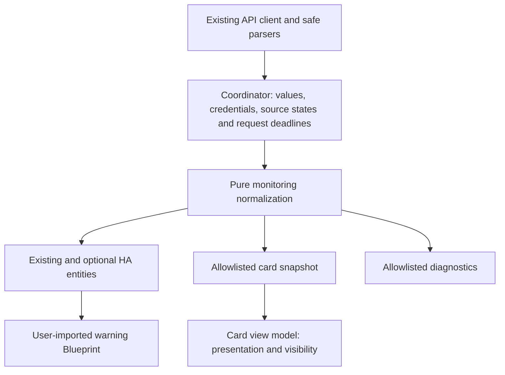

# Codex Usage 0.7 design and delivery specification

Status: design review. Product decisions below are approved in the conversation; technical refinements are proposed after inspection of the current code. This document does not authorize publication or claim implementation.

Baseline: `ba6324715bc7947875aeb0cf670b8dea6abfd520`, version `0.6.5`. Reviewed on 2026-09-05. Recheck the baseline before implementation.

## 1. Outcome and decision authority

Deliver one version **0.7.0**, in three internally testable work blocks. Local commits after completed blocks are authorized. Publication, tagging and a GitHub release wait until all blocks and release gates are complete and publication is requested. A local design commit is part of planning, not a release.

This specification supersedes conflicting proposals in the 2026-09-04 research reports and implementation plans. In particular, it replaces separate releases, Workspace Reconfigure, sources visible by default, ambiguous monetary budgets, and the proposed unconditional card schema-v2 switch. Older documents retain useful evidence and example tests, but must not be executed as the 0.7 specification.

The [2026-09-05 documentation recheck](../../research/2026-09-05-openai-documentation-recheck.md) adds source-backed corrections for shared usage, signed credits, paid resets, enterprise visibility and conflicting Analytics authentication guidance. These refinements are incorporated below.

### Confirmed product decisions

| Decision | 0.7 requirement |
| --- | --- |
| Architecture A | Gradually consolidate shared business rules into the existing coordinator architecture |
| Card layout A | Main limits first, explicit restriction summary, compact allowance information, collapsible details |
| Missing data | Core rows retain their position and use an em dash; optional missing values disappear in automatic mode |
| Optional sections | Three modes: Automatic, Always show, Hide; default Automatic |
| Source details | Same three modes, but default **Hide** |
| Details panel | Collapsed by default; retain the existing `compact` setting and explicit saved values |
| Optional requests | Profile and reset-detail requests enabled by default, separately disableable in integration options |
| Diagnostic timestamps | Four independent timestamp entities, disabled by default |
| Usage budget | Remaining percentage points spread over time until reset; optional entity per eligible window |
| Workspace identity | Fixed for the lifetime of an entry; another workspace requires another entry |
| Documentation | Repository documentation in English only; integration and card UI remain English/German |
| Release | One 0.7 release after all three blocks; intermediate local commits |

### Included

Reset consistency; complete limit status including windowless restrictions; source status and timestamps; nullable values; correct entity semantics and dynamic naming; card and editor updates; optional request controls; HTTP backoff; safe diagnostics; targeted card-registration Repair; warning Blueprint with persistent hysteresis; usage budgets; documentation and actual card screenshots; migration and release verification.

### Deferred

New cross-account comparison mode, built-in history charts, reset calendar, App Server/day-data adapter, per-feature binary sensors, repeated warning reminders, reset redemption, purchases, custom update entity and externally sent test notifications. Existing account selection and `auto`/`single`/`all` behavior remain supported.

## 2. Review findings and resolutions

| Finding in current code or prior proposal | Resolution |
| --- | --- |
| Card and sensor derive reset counts from different sources | One reset summary, used by both |
| `parse_reset_credits({})` produces zero | Missing count becomes `None`; reported zero remains zero |
| Credit `has_credits` and `unlimited` use `bool(..., False)` | Accept real booleans only; represent absent or malformed values as unknown |
| Card only serializes windows and misses a windowless restriction | Add a bounded list of limit-level statuses |
| Account blocker currently colors every window as blocked | Keep global restriction, feature restriction and numeric window usage separate |
| Boolean false in one known limit can conceal another unknown limit | Use the explicit aggregation rule in section 4 |
| Card parser accepts only `schema_version == 1` | Retain schema 1 and add optional fields; no unconditional version bump |
| `accounts/check` only runs during setup/reauth | Fourth timestamp is **Last workspace discovery**, not a live account-status poll |
| Source state held only in a successful coordinator result becomes stale on request failure | Coordinator owns current source state independently from last successful values |
| Optional reset request disabled, but usage still reports a count | Continue displaying the usage-sourced count; hide disabled detail data |
| Refreshed credentials returned only after successful usage | Persist successful token rotation before a subsequent usage error can discard it |
| Mockup shows a euro/month budget | Illustrative error: usage budget uses percentage points/hour or day; no currency inferred |
| Missing budget value could retain a past reset indefinitely | Suppress after reset or stale core usage; no extrapolation across windows |
| Banked-reset clarification permits a changed weekly reset date | Adopt each new backend window atomically; invalidate old budget and stale expiry context |
| Existing editor collapses Automatic into booleans | Add an actual three-state control while retaining saved YAML values |
| Credit amounts use `formatUsd`; false availability hides known negative balance | Credit-unit formatting and known numeric balance take precedence over availability copy |
| "Blocked" copy overstates a reached included quota | Name the reached quota/restriction without claiming every ongoing task has stopped |
| Reset parser collapses absent and empty lists | Preserve `details_present` from the actual HTTP shape; never infer list completeness |

No claim about a new OpenAI endpoint is needed for these changes. The four existing HTTP read endpoints and existing authentication flow are sufficient.

## 3. Architecture and ownership

Keep the API DTOs, API client, coordinator, entity registry integration and authenticated card WebSocket. Introduce focused normalization helpers, not a general data framework or a new database.

### Proposed file responsibilities

| File | Responsibility |
| --- | --- |
| `custom_components/codex_usage/api.py` | DTOs, strict parsing, safe HTTP errors, credential refresh |
| New `custom_components/codex_usage/monitoring.py` | Source/limit/reset summary types and deterministic normalization |
| New `custom_components/codex_usage/budget.py` | Pure usage-budget calculation with explicit clock and validity rules |
| New `custom_components/codex_usage/retry.py` | Parse Retry-After and compute bounded scheduling state |
| `custom_components/codex_usage/coordinator.py` | Request orchestration, credential persistence, caches and live source state |
| `custom_components/codex_usage/config_flow.py` | Optional request settings and workspace-discovery timestamp handoff |
| `custom_components/codex_usage/sensor.py` | Preserve existing entity definitions; consume shared summaries for affected values |
| `custom_components/codex_usage/binary_sensor.py` | Shared aggregate restriction and compact explanatory attributes |
| New `custom_components/codex_usage/diagnostic_sensor.py` | Timestamp entity classes, imported by the sensor platform; no new HA platform |
| `custom_components/codex_usage/card_data.py` | Permission checks and allowlisted transport serialization |
| New `custom_components/codex_usage/repairs.py` | Deduplicated registration issue lifecycle |
| `frontend/src/card-data.ts`, `types.ts` | Additive DTO parsing and nullable types |
| `frontend/src/config.ts` | Defaults and saved-config compatibility |
| `frontend/src/status.ts`, `view-model.ts` | UI status precedence, visibility, grouping |
| `frontend/src/codex-usage-card.ts` | Card rendering and timer lifecycle |
| New `frontend/src/codex-usage-card-editor.ts` | Move the existing editor without changing its element name; add three-state controls |
| `frontend/src/localize.ts` | English/German UI copy |
| New `blueprints/automation/codex_usage/usage_warning.yaml` | User-configured warning automation |

Existing ordinary sensor extractors can continue to use the normalized API DTOs. Only disputed/derived rules move into the shared model. Do not rewrite every extractor to achieve a nominal architectural uniformity.

## 4. Data contracts

All dates are aware UTC datetimes internally and ISO-8601 strings in the card. DTOs do not contain presentation strings for unknown values. Calculations take an explicit `now`; entity properties perform memory-only reads/calculations.

### SourceState

Keys: `usage`, `profile`, `reset_details`, `workspace_discovery`.

Fields: `state` (`ok`, `error`, `unsupported`, `disabled`, `never`), `last_attempt`, `last_success`, `retry_at`, `error_code`, `refresh_mode` (`poll` or `on_auth`), `expected_interval_seconds` (nullable).

`error_code` is a small safe enum such as `rate_limited`, `connection`, `authentication`, `invalid_response`, `http_error`; never exception text or a response body. Staleness is derived separately from request state. A failed retry does not advance `last_success`.

Usage failures update this live source object before raising the existing HA coordinator failure. The snapshot reads live source state even while last successful data remains cached. Diagnostic timestamp availability is independent of a failed core usage request.

Workspace discovery remains setup/reauth-only. Persist only its last successful timestamp as optional entry metadata when that operation succeeds; missing metadata on an upgraded entry means unknown until a real discovery succeeds. Preserve it during token refresh. It has no scheduled staleness alarm, and `never` does not make it a recurring problem. Label it "Last workspace discovery" everywhere. It is not evidence of ongoing account availability.

Other source states and cached endpoint values are memory-only. Restart starts these sources at `never` until actual success; do not invent a timestamp from entry creation or restore cached measurements as current data.

### Limits and restriction summary

`LimitStatus`: stable limit ID, bounded display name, `source` (`main`/`additional`), `allowed: bool | None`, `reached: bool | None`. Status survives without windows. Preserve parser caps, and do not serialize duplicate aliases for nonstandard main windows.

Limit rule: `allowed == false` or explicit `limit_reached == true` means reached. Otherwise an explicit false means not reached; if only `allowed == true` is present, availability is known. Missing flags do not become false. Record contradictions as safe counts, with restrictive evidence taking precedence.

Aggregate `limit_reached`: true when any explicit global or limit restriction exists; false when the main limit and every actually reported additional limit have a known non-restricted status; otherwise unknown. An absent optional credit/spending capability does not make the aggregate unknown. Explicit spend/overage restriction does make it true. An unknown reason reported as a blocker means restriction with unknown cause, not unknown availability.

`reason` uses a fixed enum: `spend`, `credits`, `usage_limit`, `additional_limit`, `unknown`, `none`. Priority follows that list for known concurrent reasons, with `unknown` only as a fallback reason. `affected_limits` contains sorted distinct IDs of explicitly restricted limits, maximum 50, plus `affected_limits_truncated` only when needed. Do not include changing percentages or reset dates in those attributes.

Window usage is independent of aggregate restriction. A feature restriction produces an "At least one limit reached" status and a named callout without implying that ordinary Codex use is blocked. Global spend or credit restrictions receive their own labels. A 10%-used healthy window is not painted as exhausted because image generation is restricted. Numeric consumption below the threshold is not proof of account availability when status flags are absent.

Duplicate feature IDs: detect and count collisions. Merge explicit restrictive status conservatively for the aggregate. Do not invent new entity IDs or silently pick an ambiguous numeric value: conflicting duplicate windows become unknown for that identity. A matching legacy code-review alias may be deduplicated when its values are identical. Existing registry identities remain unchanged.

### ResetSummary

Fields: `available_count: int | None`, `count_source: usage | reset_details | none`, `count_updated_at`, `total_earned: int | None`, `next_expiry`, `details_consistent: bool | None`, `details_updated_at`.

Add `details_present: bool` to the reset-detail DTO and summary, derived from an actually supplied list in the received HTTP payload. Missing/null/non-list means false; an empty list means true with no parsed rows. Malformed list rows are counted safely. This flag does not claim a complete ledger, and cannot override an explicit count. The App Server documents a comparable distinction but does not establish a WHAM field contract; do not introduce its camelCase keys into HTTP parsing.

| Inputs | Result |
| --- | --- |
| Usage count 4; detail count 1 | Count 4 from usage; `details_consistent=false`; no expiry |
| Usage count 0; details say 1 | Count 0; no expiry; zero is not missing |
| Usage count unknown; recent enabled details count 2 | Count 2 from details |
| Neither source has a valid count | Count unknown; never coerce to zero |
| Details disabled; usage count 4 | Count 4 remains; detail total/expiry hidden |
| Detail count stale beyond two hours, no usage count | Count unknown; diagnostic source state retains last success |

Detail freshness threshold: two hours, matching two nominal hourly periods. Expiry is the earliest **future** date among explicitly `available` credits, only if details are recent, current count is positive, and counts agree. Unknown item status is not eligible. Call the value "Next known expiry"; do not imply the list covers all credits. Lifetime earned count remains a historical detail with its source age, independently of the current available-count comparison. Same clock input yields identical sensor and card summary.

Disabling a source clears its cached payload from presentation. An HTTP failure retains the last successful optional payload during the session; a successful payload missing a field clears that field rather than carrying it forward forever.

### Banked-reset clarification, verified 2026-09-05

OpenAI describes a banked reset as a saved one-time allowance reset, distinct from purchased credits. A full reset refreshes the five-hour and weekly windows and changes the weekly reset date. Consumption requires at least one eligible window to reset successfully. Automatic/global resets do not create a banked reset. Expiry and eligibility vary; the account/offer supplies expiry information. [Official banked-reset guidance](https://help.openai.com/en/articles/20001498-how-banked-codex-resets-work).

The fetched page reported "Updated: 2 hours ago". This is an observation at retrieval, not proof of the exact publication time of each paragraph. The article establishes product semantics, not a stable HTTP schema, reset-type enum or complete reset-credit ledger.

Engineering consequences for 0.7:

- English card label **Available resets**; keep existing entity unique IDs, `resets` units and legacy transport/configuration keys. Documentation distinguishes window reset times from banked-reset expiry. Do not relabel every unknown `reset_type` as Full reset or infer affected windows from an unverified enum.
- Each successful usage response replaces the relevant window's percentage, duration and `resets_at` together. Adopt changed dates immediately on that response; do not retain an old weekday or calculate a replacement date by adding seven days. Entity identity depends on the stable window identity, never on the reset timestamp.
- Observe changes to the usage-sourced reset count or significant main-window reset-time shifts in memory. Compare dates with the context last reconciled by a detail fetch; use a 60-second tolerance because the existing parser can reconstruct timestamps from relative seconds. Display every new backend date, but do not invalidate expiry merely for sub-minute timestamp jitter. A significant change advances a `reset_context_changed_at` marker; it does not create a reset-use event. The next successful reset-detail fetch must be at/after this marker before its expiry can be presented alongside the new usage context. This can happen in the same coordinator update if the optional fetch is due. Do not fetch more often to force reconciliation.
- `details_consistent` remains a count comparison, not proof of transaction consistency. Expiry additionally requires the context-order check above. When a context change invalidates expiry, count remains usable from the current usage response and the optional expiry row disappears in Automatic mode. No warning is required merely for this expected reconciliation delay.
- Do not decrement the available count locally when a window resets or an expiry passes. A lower count cannot distinguish redemption, expiry or provider correction. Do not derive the count from the length of the detail list; it may be partial. Count follows the selected source and its freshness rules. Once a known expiry passes, suppress that expired date until eligible current details provide another valid date.
- Do not derive expiry from `granted_at` plus a fixed number of days. Preserve parsed metadata without creating per-credit entities, transaction history, a reset action or a new external endpoint.

These are implementation decisions inferred from the documented behavior and current asynchronous polling design. They do not assert a new backend guarantee of simultaneous updates across endpoints.

### UsageBudget

One canonical sensor value per eligible window: **percentage points per hour**, unit `pp/h`, no device class, no state class, disabled by default. It is an allocation calculation, not a measured usage rate or an exhaustion forecast.

`budget_pph = remaining_percent / ((resets_at - now).total_seconds() / 3600)`.

Require a finite remaining percentage within 0..100, a known positive window duration, a future reset, and remaining time no greater than the reported full window duration. Suppress when the core request has failed or its last success is older than `max(900 seconds, 2 * configured usage interval)`. At reset or invalid time, return unknown. Preserve numeric zero. No clamping the result to 100 pp/h, which would distort valid short-time allocations.

For durations of at least one day, the card displays `budget_pph * 24` as pp/day; shorter windows display pp/hour. Choose the unit from window duration, not a changing countdown. Example: 18 percentage points over three days = 6 pp/day. Under one minute remaining, omit the card budget and show "Reset imminent" to avoid an unhelpful large figure.

Compute the canonical budget at the coordinator observation time and include `budget_calculated_at`. The frontend displays that same value, converting units only; the minute timer updates relative times and suppresses expired/stale budgets, but does not calculate a competing live budget. No additional network traffic or independent sensor timer for budgets.

Recompute budget and existing pace using the new window tuple whenever the reported reset date changes. A changed date never increases the banked-reset count or asserts redemption. For example, an old observation of 18 points remaining with 72 hours left yields 0.25 pp/h; a new observation of 100 points and 168 hours yields approximately 0.595238 pp/h. This is an arithmetic fixture, not a promise that every reset establishes exactly seven days.

Paid instant resets introduce a separate transition case: do not derive the next date from purchase time. The product guide ties the new period to subsequent usage. Accept restored remaining usage with a missing reset date, omit budget for that observation, and adopt the next valid backend date when supplied. No reset purchase tracking or local period-start clock is added.

## 5. Card and editor

### Layout A

1. Title, selected account/workspace label and aggregate status.
2. Standard main-limit rows, remaining allowance, usage bar, reset time, valid budget and existing optional pace.
3. A compact named restriction summary when needed, including windowless restrictions.
4. A compact reset-count row when its visibility policy permits.
5. Collapsible details for additional limits, credit/spend breakdown, profile and account information.
6. Main last-update indicator; optional source details according to their own visibility policy.

The initial euro amount and "monthly budget" in the visual sketch are explicitly not requirements. Credit/spending quantities use the existing backend contract and correct credit units; do not convert to EUR/USD without supported currency metadata. Audit existing `formatUsd` call sites because the HA sensors currently expose these quantities as credits.

For fields currently defined in credit units, remove currency formatting. A known finite signed credit balance remains visible even when `has_credits=false`; label it as a balance, not a positive available amount. Preserve zero, negatives and unknown separately. Unlimited status can be a separate label; it must not silently reinterpret a reported balance. Percentage-only spend data is useful even without absolute values. Do not reconstruct values omitted by administrator visibility settings.

Use precise quota wording such as "Included usage limit reached". Retain explicit backend spend/credit restrictions, but do not infer global execution availability from percentages, a balance or a single feature restriction. No new can-use-Codex boolean. The earlier image-limit mockup is a synthetic stress example; use Code review in product screenshots unless a separate image limit is actually observed in a supported response.

### Visibility contract

Keep `sections.<key>.visible: true | false | "auto"`, and retain the individual `values` booleans. Add `budget` and `sources` sections. `sources.visible` defaults false; optional data sections default `"auto"`; budget defaults `"auto"`.

| Mode | Core main-limit rows | Optional section |
| --- | --- | --- |
| Automatic | Keep standard rows; unknown values render em dash | Show known values or meaningful reported statuses; omit empty fields |
| Always show | Keep selected rows; unknown values render em dash | Keep a single representative row if empty; do not print every absent metric |
| Hide | Respect explicit saved hide configuration | Hide section completely |

Default core rows are the existing five-hour and weekly slots. An unreported slot is a neutral placeholder, never a claimed allowance. Nonstandard reported main windows are also shown. An existing slot survives temporary data loss; `show_unavailable_limits=false` does not erase core placeholders. Explicit user hides and per-value false settings take precedence over defaults. Preserve old IDs used in saved section-value settings.

Overall status stays available as the card's summary even when optional details are hidden. Hiding an additional section hides its detailed rows, but cannot turn an actually restricted account summary green. The summary may still name the reason. Card section settings never enable/disable API polling or HA entities.

Source details modes: Hide renders no optional source list or source warning; Always show lists all four with correct polling/lifecycle labels; Automatic shows only actionable polling-source errors, stale retained data or no successful initial reading. Disabled and unsupported optional sources are not errors. Workspace discovery age alone is never actionable. Main fetch failure/last-update indication remains part of core status even with source details hidden.

Retained stale profile fields have one group-level historical/stale indication, not a warning per metric. Source-list Hide suppresses the list, not the distinction between historical cached values and a fresh reading. If all optional sections are hidden/empty, omit the Details toggle. Forced-visible section with empty data is not considered empty.

Use semantic status text and em dash accessible labels; do not rely on color alone. Unknown progress must not publish `aria-valuenow=0`; show a neutral placeholder. Preserve keyboard interaction, HA themes, user colors, reduced motion and responsive rendering. More Info links require an enabled entity available to the viewer.

Details default remains `compact: true`. Retain `compact: false` and all explicit saved settings; no separate competing `details_open` option. Upgrade the editor controls to three-state selectors and preserve the existing element registration when moving editor code to its own file.

Local minute updates are active only while the card is connected. Clean up timers and event subscriptions on disconnect; repeated reconnects must not create duplicates. A timer tick does not call WebSocket or HTTP.

### Transport compatibility

Keep `schema_version: 1`. Add `limit_statuses`, `sources`, reset provenance/consistency and per-window budget fields; preserve required legacy fields and their types. The new parser accepts old snapshots with these additions absent. It must not invent freshness/budgets for an old server.

Old cached cards can read the envelope but retain their previous limitations for new optional features until refreshed; do not promise feature parity. When the reset summary has no known count or useful legacy detail, serialize `reset_credits: null` to avoid the old renderer's null-to-zero fallback. Preserve existing global `blocker`; new clients use added statuses for feature restrictions. Test an actual old parser fixture against new envelopes.

Keep account-level read authorization fail-closed, including access to all entry entities. Use HA entry IDs for UI selection, never backend account/user IDs. All new nested fields require an explicit serialization/parser allowlist.

## 6. Entities and migration

Keep existing unique IDs, entity IDs, device identity and user names. Capability-based discovery and registry recovery remain active when values temporarily disappear. Correct the dynamic-ID parser by matching the right-hand window/metric suffix so IDs containing `_primary_` or `_secondary_` are restored correctly. New metric suffix `budget` must be supported without modifying old suffixes.

Add four diagnostic timestamp entities with stable suffixes `usage_last_success`, `profile_last_success`, `reset_details_last_success`, `workspace_discovery_last_success`. Category diagnostic, timestamp device class, no unit/state class, disabled by default. Unknown timestamp is unknown; enablement does not trigger requests. Do not add a duplicate health sensor.

Budget entity IDs append `_budget` to the existing corresponding window identity stem. Five-hour and weekly stems remain canonical regardless of backend order. Other window identities follow the existing dynamic rule. Do not create entities for invented placeholder windows beyond existing standard definitions.

Dynamic entity names use translation keys plus a bounded backend name and language-neutral duration placeholder. UI duration words are translated. Retain user overrides and do not mass-rewrite registry names when their origin cannot be identified.

### State-class correction target

| Metrics | Target |
| --- | --- |
| Current usage/remaining percentages and existing pace | Keep current measurement class |
| Lifetime tokens, total threads, total skills, unique skills | `TOTAL`, no fabricated resets |
| Current streak | Keep current measurement class |
| Peak daily tokens, longest streak, longest turn, aggregate fast-mode/reasoning shares | No state class |
| Credit balance, spend used/limit/remaining | Keep current state-class absence in 0.7; avoid unsupported consumption statistics |
| New budget and timestamp entities | No state class |

Validate the target against actual HA recorder behavior on the minimum version before applying it. Existing historical sums are not recalculated by a metadata change. Never delete/modify historical recorder rows to make a migration pass. If the recorder requires user repair, document it; if the change cannot be safely supported, retain that particular existing class and record the deviation as a release-blocking design decision rather than silently shipping incompatible metadata.

Nullable credit flags propagate to the optional binary sensors. Unknown must remain unknown; schema errors must not claim "no credits". Warn-Blueprint conditions use only available numeric consumption sensors.

## 7. Request controls, failures and Repairs

Integration options add `fetch_profile: true` and `fetch_reset_details: true`. Missing keys in old entries default true. Preserve the existing main interval 60..3600 seconds, default 300 seconds. Optional successes remain hourly and ordinary optional transient failures retry after 900 seconds; unsupported endpoints recheck after an hour. No extra independent interval controls in 0.7.

Changing options reloads the entry through the existing HA path. A disabled optional source schedules no requests and contributes no payload; re-enabling attempts at the next normal update. No global shutdown because an optional source failed. Main auth failures use the current reauth flow. Reauth must preserve both workspace and user identity; another identity aborts before replacing saved credentials. No Workspace Reconfigure flow.

Parse Retry-After as nonnegative integer seconds or HTTP date for 429 and for 503 when present. Prefer server Date for absolute-header delta when valid; otherwise use UTC now. Invalid/missing/past header uses existing local backoff. Accept zero but still retain the normal retry floor. Never retry sooner than a valid server deadline. Long delays are not shortened: schedule bounded local wakeups if required by HA while retaining the full deadline. Store only safe deadline metadata, not raw headers.

Use one read-request cooldown per entry for a 429 because the scope of the server throttle is unspecified; stop further optional requests in that update. For a 503 use the affected endpoint's deadline. No sleep in an entity property or request callback. Manual refresh and reconnect must respect cooldown. Serialize main and optional requests within an entry to avoid token races.

Credential refresh success must update coordinator credentials and config-entry token storage before the following resource request, including when it returns 429, 503, malformed JSON or a connection error. Preserve identity and discovery metadata during this update. Confirm with a rotating-refresh-token test; do not merely retain old credentials after a failed usage call.

A live usage failure uses HA's existing unavailable semantics. Preserve last-success timestamps and allow card rendering of last-known values with a core connection/age indication; suppress derived budget. Do not move registration ahead of `async_config_entry_first_refresh` just to display an account early. Before any entry loads successfully, show a neutral no-data/loading view without account identifiers. A card with an already received permitted account retains its core placeholders during a subsequent fetch failure; a never-authorized account is never fabricated.

Card-registration Repair: one integration-wide issue for a failed automatic resource registration in storage mode, with English/German explanation and instructions to reload/check resources. Do not create an issue for normal YAML-managed resources or transient optional endpoint errors. Deduplicate across entries; delete on successful registration and after last entry unload. Existing auth failures continue through reauth rather than duplicate Repairs.

Diagnostics include source state, normalized limits including windowless entries, reset provenance/consistency, configured options, and safe counts for dropped/malformed/duplicate structures. Do not list unknown field names/values, credentials, backend identities, arbitrary exception strings or full responses.

## 8. Warning Blueprint

One separately imported automation per chosen consumption sensor. Inputs: usage sensor with `%` unit, warning threshold (default 80), hysteresis (default 5 percentage points), a dedicated `input_boolean` helper, and a user-selected action. Public Blueprint copy and documentation are English. Existing UI translations remain bilingual.

Trigger on sensor state, HA startup and a five-minute reconciliation tick. Numeric finite 0..100 usage and a known helper state are required. At/above threshold with helper off: run user action, then set helper on. At/below `max(0, threshold - hysteresis)`: clear helper. Between thresholds retain state. Unknown/unavailable sensor values neither warn nor clear the helper. At default values: warn at 80, rearm at 75.

Use a helper without a forced initial value so HA can restore it. Each automation requires a separate helper. A failed action leaves it off and can retry on a later trigger. `mode: single` prevents concurrent executions. Documentation states the at-least-once retry possibility and crash gap between action and helper update; no exactly-once external delivery claim. An unnoticed recovery while HA is down can require manual helper reset.

A shifted reset date or lower banked-reset count does not rearm the warning. Only a valid observed usage at/below the recovery threshold clears the helper. This also handles a full reset followed by renewed usage without guessing which reset mechanism caused the change. A reset and renewed high usage entirely between two polls remain an unobserved recovery under the documented limitation.

No automatic installation/activation and no external recipients selected by the integration. Local runtime tests call a counting test service. HACS installation alone does not import the root-level Blueprint. Verify the published import URL only when publication actually occurs.

## 9. English documentation and release material

Shorten README to purpose, requirements, install, first setup, card screenshot and links. Preserve links/anchors commonly used by the current card help URL or update them together.

Create `docs/installation.md`, `docs/card.md`, `docs/entities.md`, `docs/automations.md`, `docs/troubleshooting.md`, `docs/privacy.md`, `docs/upgrading-to-0.7.md`. Store real rendered screenshots under `docs/images/`. Synthetic labelled accounts only; no credentials or private workspace labels.

Entity reference lists unique key, name, unit, device/state class, default enablement, required source and unavailable behavior. Card reference distinguishes presentation visibility, entity enablement and endpoint enablement. Include all three visibility modes, default-hidden source details, collapsed details, known-value vs missing/zero behavior and usage-budget units.

Upgrade guide covers retained identities, state-class impact, optional flags defaulting on, updated card cache/resource version, source labels, Blueprint import, helper restore behavior and rollback limitations. State dependency on undocumented backend endpoints accurately; do not advertise an Astra-specific migration or imply official OpenAI support.

The card/automation guides link the official banked-reset article and explain the difference between allowance reset, saved-reset availability and saved-reset expiry. Describe that new server dates are adopted after polling and that optional expiry information may temporarily disappear during reconciliation. Keep offer-specific eligibility and durations out of integration defaults.

Explain shared agentic usage, lack of per-app attribution, credit units and signed balances, quota-reached vs execution-availability, percentage-only enterprise views, and supported HTTP shapes. Do not promise a fixed number of remaining prompts or full invoice reconciliation. The separate Enterprise Analytics adapter stays deferred: official Admin-key provisioning guidance conflicts with the Learn overview's organization-key statement, and exact routes were not verified from the linked dynamic reference. No credential/endpoint substitution in 0.7.

Before release, align manifest version, CARD_VERSION, User-Agent, frontend package/lock and documentation resource examples to 0.7.0; include the generated bundle. Version changes are an end-of-block-three preparation step, not an intermediate release. Prepare English release notes as a local file without creating a tag or remote release.

## 10. Delivery blocks, estimates and dependencies

Estimates include implementation, meaningful tests and documentation for the stated scope; they are engineering estimates, not measured work already completed. The card/editor details and token/compatibility fixes refine the earlier audit estimate; removing Reconfigure reduces work.

| Block | Deliverables | Raw effort | Commit checkpoint |
| --- | --- | --- | --- |
| 1. Consistent data and card | Shared summaries, nullable parsing, limits/status, reset/source presentation, layout A/editor, identity recovery and state-class migration tests | 28–44 h | Consistent backend/card with generated bundle and relevant passing tests |
| 2. Robust operation | Optional options, Retry-After, rotation persistence, discovery timestamp capture, Repair lifecycle and operational docs | 16–26 h | Tested lifecycle/retry behavior; no publication |
| 3. User functions and final verification | Four timestamp entities, usage-budget entities/card, Blueprint, final English docs/screenshots, upgrade tests, version alignment and complete verification | 18–30 h | Complete 0.7 candidate, local release notes and verification report |
| Total | All three blocks | **62–100 h** | One release after completion |
| Planning allowance | Total including 25% contingency | **78–125 h**, about 10–16 eight-hour days | Re-estimate after block 1 |

The banked-reset clarification adds an estimated **2–4 hours** for context invalidation, transition fixtures and documentation within the stated contingency. It does not require a fourth block or a new integration component. Reassess that estimate if real endpoint responses reveal an additional schema change.

The overall documentation recheck adds **3–6 hours** for signed-balance/label/detail-presence work and added fixtures beyond existing scope. Including both additions, the explicit work estimate is now **67–110 hours**. Retain the **78–125 hour** contingency envelope with 5–10 hours of reserve now allocated; the base rows above record the original estimate. Re-estimate after block 1 rather than multiplying the envelope by another contingency factor.

Detailed task plans will be separate per block and reference this spec. Within blocks, build normalizers before consumers, data/visibility tests before rendering, scheduling primitives before coordinator changes, then verify bundle and migration at the checkpoint. Source timestamp names and budget serialization are defined here so later blocks extend the same contract.

No unrelated dependencies or refactoring. Use a development worktree/branch at implementation time if isolation is required, honoring existing user changes. Commit only scoped files after their verification. Do not include visual-companion server state, session keys or tool logs in commits. No push/tag/release during this planning task.

## 11. Acceptance and test strategy

### Behavior matrix

| Case | Required observation |
| --- | --- |
| Usage reset=4, detail reset=1 | Sensor/card both 4; expiry omitted |
| Empty reset/credit objects | Unknown flags/count, never false/zero by default |
| Main healthy, image limit restricted without window | Named restriction, main percentage stays healthy |
| Main status known false, reported feature unknown | Aggregate unknown; feature not invented available |
| Global spend restriction | Global label correct; window percentage unchanged |
| Fresh usage, profile seven days old | Usage freshness correct; profile grouped as historical |
| Source-details hidden | No source list; main failure indicator still works |
| Reset-details disabled, usage count present | No reset HTTP request; usage count visible in Automatic |
| Profile disabled | No profile requests, no cached profile shown, no source error |
| Empty optional section in Automatic/Always/Hide | Omitted / one neutral placeholder / omitted |
| Explicit old section/value hides | Retained after loading and saving editor |
| Core values temporarily missing | Stable standard rows, neutral em dashes, no fake progress zero |
| Timer repeated reconnect/disconnect | One timer/subscription, no network on tick |
| Dynamic ID contains `_primary_` | Correct right-suffix recovery, no duplicated entities |
| Duplicate conflicting feature windows | Aggregate conservative, numeric value unknown, safe count incremented |
| Budget 18 points over 72h | Sensor 0.25 pp/h; card 6 pp/day |
| Budget invalid/reset/stale/core failure | No misleading active budget |
| Main-window reset date shifts | Same entity IDs; new date, budget and pace use one new response tuple |
| Usage context changes while details still have equal counts | Current count shown, old expiry suppressed until detail fetch catches up |
| Relative reset-time reconstruction jitters by a few seconds | Updated date displayed; valid expiry not repeatedly invalidated |
| Known expiry passes with unchanged cached count | Expired date omitted; no locally fabricated count decrement |
| Automatic reset with no banked count change | Budget/pace update; no invented banked-reset grant or use |
| Full-reset attempt with no eligible window and unchanged returned data | Count remains unchanged; integration invents no consumption event |
| Unknown reset type or missing expiry | No Full-reset label or generated expiry; valid aggregate count retained |
| Reset details absent/null/empty/partial | Presence preserved, count never inferred from rows |
| Restored usage with no reset date, then valid new date | No fabricated date/budget in first response; correct values in second |
| Credit balance -3.5 with `has_credits=false` | Signed balance visible in credits, no dollar label or unavailable replacement |
| Credit balance zero/unknown, unused included quota | Distinct values; no inferred global usage block |
| Percentage-only spend response | Valid percentage shown; missing amounts hidden in Automatic |
| HTTP Retry-After seconds/date/invalid/very long | Deadline honored, normal floor retained, no hot loop |
| Successful token rotation, next request fails | New tokens saved once; next request uses them |
| Optional failure with healthy core | Core entities remain usable |
| Fourth timestamp on old installation | Unknown until actual discovery, no fabricated date or periodic warning |
| Main outage after success | Last-success timestamp still readable, live source error serialized |
| No first success | Neutral no-data view, no fabricated account or healthy status |
| Permission denied for one entry entity | No whole-entry payload, including new fields |
| Upgrade preserved identity | Registry IDs/names/history remain associated with same workspace/user |
| Storage/YAML registration modes | Repair for real storage failure only; cleanup verified |
| Blueprint 70→80→90→78→75→81 | Exactly two local warning calls |
| Blueprint restart/action error/unknown | Restore/hysteresis and retry behavior match section 8 |
| Warned at 85; date changes; usage stays 85, then falls to 0 and reaches 81 | No rearm on date alone; one new local warning only after observed recovery |
| Old card/new snapshot; new card/old snapshot | Envelope readable; unsupported new details gracefully absent |

### Gates

Python: existing Ruff format/lint and unit suite; targeted new tests for pure rules, scheduling and identity recovery. Frontend: format/lint/typecheck, unit and coverage gates, production build, audit, reproducible bundle, Playwright at narrow/wide sizes and English/German. Cover themes, keyboard focus and long escaped labels with synthetic fixtures.

Linux HA integration tests cover setup, options reload, coordinator failure, recorder metadata upgrade, RestoreEntity/helper behavior, Repairs and actual Blueprint execution. Test minimum HA 2026.3.0 and the currently pinned HA 2026.8.3. At release time check compatibility with the then-current stable HA separately; do not silently change the minimum.

The existing minimum-version job only runs ordinary tests; it is not evidence of minimum-version recorder/Blueprint runtime support. Add a compatible Linux runtime matrix with explicitly compatible pytest-homeassistant-custom-component versions. Resolve its HA dependency pins instead of forcing incompatible packages. An unavailable Linux runner is an outstanding gate, not a pass.

Full gates include HACS/hassfest and existing CodeQL checks before publication. Use existing authorized infrastructure or local equivalents; request remote push separately if needed. Never substitute the historical 0.6.5 test counts for tests of the 0.7 candidate.

### Rollback

Restore prior component/bundle version and reload; new optional registry entities may remain disabled/unavailable until removed deliberately. Existing entity IDs stay addressable. Recorder metadata changes and new statistics are not automatically reversed by a code rollback; document that limitation and make a normal HA backup before migration. Removing the optional Blueprint only affects its automation/helper when no other automation uses it.

## 12. Evidence and design-review checklist

Current-code evidence: `api.py` parsing/request methods, `coordinator.py` optional schedules/return path, `binary_sensor.py::_limit_reached`, `card_data.py::build_card_snapshot`, `frontend/src/card-data.ts::normalizeCardSnapshot`, `frontend/src/config.ts::normalizeSections`, and `.github/workflows/validate.yml`. This review is static; no production credentials or account changes were needed.

Official references checked 2026-09-05:

- [Home Assistant sensor entities](https://developers.home-assistant.io/docs/core/entity/sensor/): memory-only properties, timestamp types, state classes and preference for separate entities over expanding attributes.
- [Home Assistant data fetching](https://developers.home-assistant.io/docs/integration_fetching_data/): coordinator ownership and error handling.
- [RFC 9110, Retry-After](https://www.rfc-editor.org/rfc/rfc9110.html#name-retry-after): HTTP date or delay-seconds form.
- [How banked Codex resets work](https://help.openai.com/en/articles/20001498-how-banked-codex-resets-work): product clarification underlying the reset-context and transition rules in section 4.

Self-review completed against the conversation and baseline code: source visibility exception retained; explicit card hides retained; reset polling separated from usage count; fourth timestamp corrected; token rotation failure covered; schema compatibility made additive; budgets separated from money and measured rates; Blueprint documents only English; reconfigure and separate releases removed.

Written-design review is the next checkpoint. After acceptance, create three detailed implementation plans with exact file changes, task interfaces, regression-test code, commands and per-block commit gates. Implementation and publication are distinct subsequent steps.
